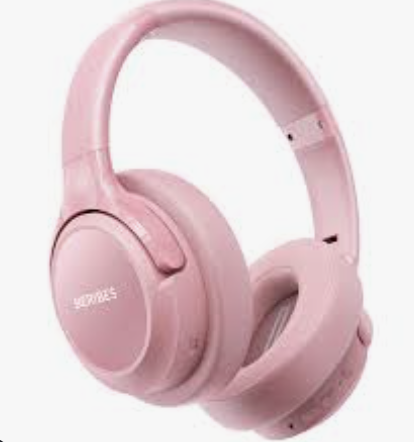
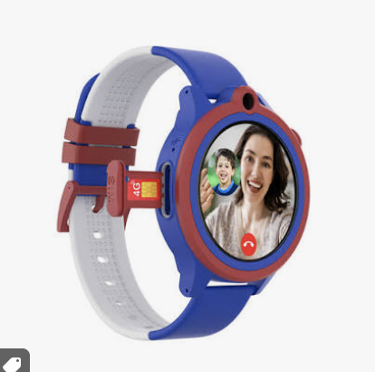
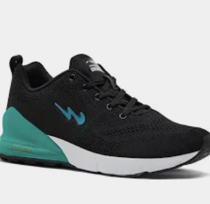

# Ex02 Commercial Website
## Date: 27/07/26

## AIM
To create a commercial website using CSS Flexbox.

## ALGORITHM
### STEP 1
Create an HTML file (index.html)

### STEP 2
Create a CSS file (style.css)

### STEP 3
Include a navigation bar with links to different sections.

### STEP 4
Add structured sections for Homepage, Products / Services, About Us, Contact Details and User Account.

### STEP 5
Include social media links at the footer with copyright information.

### STEP 6
Define global styles for fonts, colors, and layout.

### STEP 7
Style the header, navigation bar, and sections.

### STEP 8
Use Flexbox for layout design.

### STEP 9
Add hover effects and transitions for interactivity.

### STEP 10
Add Images and Media.

### STEP 11
Use optimized images for a professional look.

### STEP 12
Open the HTML file in a browser to check layout and functionality.

### STEP 13
Fix styling issues and refine content placement.

### STEP 14
Deploy the website.

### STEP 15
Upload to GitHub Pages for free hosting.

## PROGRAM
# index.html

      <!DOCTYPE html>
      <html lang="en">

      <head>
        <meta charset="UTF-8">
        <meta name="viewport" content="width=device-width, initial-scale=1.0">
        <title>AWMESON</title>
        <link rel="stylesheet" href="style.css">
      </head>

      <body>

        <header class="top-header">

          

            <a href="#home">AWMESON</a>
          

        
          

            <input type="text" placeholder="Search for products">
            <button class="search-btn">Search</button>
          

        </header>

        <!-- ===== NAVIGATION BAR ===== -->
        <nav class="category-nav">
          <a>All</a>
          <a>Electronics</a>
          <a>Fashion</a>
          <a>Home & Kitchen</a>
          <a>Books</a>
          <a>Toys</a>
          <a>Deals</a>
        </nav>

        <main>

          <!-- ===== PRODUCTS SECTION ===== -->
          <section id="products" class="products-section">
            <h2>Popular Products</h2>

            

              

                
                <h3>Smartphone</h3>
                
₹14,999

                <button class="btn btn-cart">BUY NOW</button>
              

              

                
                <h3>Wireless Headphones</h3>
                
₹1,999

                <button class="btn btn-cart">BUY NOW</button>
              

              

                
                <h3>Smart Watch</h3>
                
₹2,499

                <button class="btn btn-cart">BUY NOW</button>
              

              

                
                <h3>Running Shoes</h3>
                
₹1,299

                <button class="btn btn-cart">BUY NOW</button>
              

            

          </section>

        <!-- ===== FOOTER ===== -->
        <footer class="site-footer">
          

            

              <h4>Connect with Us</h4>
              <a href="#">Facebook</a>
              <a href="#">Instagram</a>
              <a href="#">Twitter</a>
            

          

          

            
&copy; 2026 AWMESON

          

        </footer>

      </body>
      </html>

# style.css

    * {
      margin: 0;
      padding: 0;
      box-sizing: border-box;
    }

    body {
      font-family: Arial, Helvetica, sans-serif;
      background-color: #f2f2f2;
      color: #111;
    }

    a {
      text-decoration: none;
      color: inherit;
    }

    h1, h2, h3 {
      color: #111;
    }

    /* Reusable button */
    .btn {
      background-color: #ffd814;
      border: 1px solid #a88734;
      border-radius: 5px;
      padding: 10px 18px;
      font-size: 15px;
      cursor: pointer;
      transition: background-color 0.2s ease;
    }

    .btn:hover {
      background-color: #f7ca00;
    }

    .top-header {
      background-color: #131921;
      padding: 12px 20px;
      display: flex;
      align-items: center;
      gap: 20px;
    }

    .logo a {
      color: #ffffff;
      font-size: 24px;
      font-weight: bold;
    }

    .logo span {
      color: #ff9900;
    }

    /* Search bar */
    .search-bar {
      flex: 1;
      display: flex;
      max-width: 700px;
    }

    .search-bar input {
      flex: 1;
      border: none;
      border-radius: 4px 0 0 4px;
      padding: 0 10px;
      font-size: 15px;
    }

    .search-btn {
      background-color: #febd69;
      border: none;
      padding: 0 15px;
      border-radius: 0 4px 4px 0;
      cursor: pointer;
    }

    .search-btn:hover {
      background-color: #f3a847;
    }

    .category-nav {
      background-color: #232f3e;
      display: flex;
      gap: 20px;
      padding: 10px 20px;
      flex-wrap: wrap;
    }

    .category-nav a {
      color: #ffffff;
      font-size: 14px;
      cursor: pointer;
    }

    .category-nav a:hover {
      color: #ff9900;
      text-decoration: underline;
    }

    .products-section {
      padding: 40px 20px;
      max-width: 1200px;
      margin: 0 auto;
    }

    .products-section h2 {
      margin-bottom: 20px;
    }

    .product-grid {
      display: flex;
      flex-wrap: wrap;
      gap: 20px;
    }

    .product-card {
      background-color: #ffffff;
      border: 1px solid #ddd;
      border-radius: 6px;
      padding: 16px;
      flex: 1 1 220px;
      max-width: 260px;
      display: flex;
      flex-direction: column;
      align-items: flex-start;
      transition: box-shadow 0.2s ease;
    }

    .product-card:hover {
      box-shadow: 0 4px 10px rgba(0, 0, 0, 0.15);
    }

    .product-image {
      width: 100%;
      height: 160px;
      border-radius: 4px;
      object-fit: cover;
      margin-bottom: 12px;
    }

    .product-card h3 {
      font-size: 16px;
      margin-bottom: 6px;
    }

    .price {
      font-size: 18px;
      font-weight: bold;
      margin-bottom: 12px;
    }

    .btn-cart {
      width: 100%;
    }

    .site-footer {
      background-color: #232f3e;
      color: #ffffff;
      margin-top: 20px;
    }

    .footer-links {
      display: flex;
      justify-content: center;
      padding: 30px 20px;
    }

    .footer-column {
      display: flex;
      flex-direction: column;
      gap: 8px;
    }

    .footer-column h4 {
      color: #ffffff;
      margin-bottom: 6px;
    }

    .footer-column a {
      color: #cccccc;
      font-size: 14px;
    }

    .footer-column a:hover {
      text-decoration: underline;
    }

    .footer-bottom {
      border-top: 1px solid #3a4553;
      text-align: center;
      padding: 15px;
      font-size: 13px;
      color: #cccccc;
    }

    @media (max-width: 700px) {
      .top-header {
        flex-wrap: wrap;
      }

      .search-bar {
        width: 100%;
        max-width: 100%;
      }
    }

## OUTPUT

## RESULT
The program for creating commercial website using CSS Flexbox is executed successfully.
